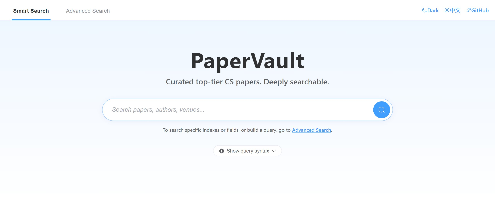

<p align="center">
<h1 align="center">  PaperVault</h1>
</p>
<p align="center">
  <strong>English</strong> | <a href="README.md">简体中文</a>
</p>

<p align="center">
  
</p>

## :jack_o_lantern: Project Introduction

PaperVault aggregates paper metadata from top-tier conferences and journals scattered across ACL Anthology, OpenReview, CVF Open Access, NeurIPS Proceedings, DBLP and other venues into a single, **continuously and automatically updated** corpus, and ships a ready-to-use web search site on top of it. You can use it as a research-grade paper dataset to download directly, or as a reference implementation to fork your own paper search site from.

### Paper metadata corpus
- Covers top-tier venues across NLP, CV, ML, DM, DB, Speech, systems, networking, security, theoretical CS, HCI and graphics & multimedia.
- The corpus is kept current by four interlocked GitHub Actions pipelines — venue auto-discovery, incremental paper collection, abstract backfill, and GitHub code-link extraction — running on schedule without manual intervention.
- For the latest corpus scale and coverage, see [Data Statistics](#bar_chart-data-statistics) and [Coverage](#open_book-coverage) below.

### How to access the corpus
- Data is continuously published as gzip-compressed JSON Lines on the Hugging Face Dataset [`youngfish42/PaperVault`](https://huggingface.co/datasets/youngfish42/PaperVault).
- Data-only consumption: download `cache/cache.jsonl.gz` via `huggingface-cli`, or read it directly through Hugging Face's auto-generated Parquet view — no need to clone this repository.
- In-project usage: every entry script fetches the latest cache from Hugging Face on startup and writes back when finished; developers only need to set `HF_TOKEN` and `PAPERVAULT_HF_REPO_ID`.
- Full commands, code samples and offline mode are documented in the [Dataset Access](#inbox_tray-dataset-access) section below.

### Search service at a glance
- Dual-mode search: "smart search" for keywords and phrases, and "advanced search" backed by a Web of Science style query DSL plus a visual condition builder.
- Result pages support faceted refinement by research field / venue series / year, and one-click CSV / TXT export.
- The backend exposes search, suggestion and configuration capabilities through `/api/v1/*` REST endpoints, making integration or independent deployment straightforward.

## :bar_chart: Data Statistics

### Recent Update Brief

<!-- recent-update-start -->

- 📅 **Last Updated**: 2026-06-13
- 🆕 **New Papers This Update**: 30,986
- 📢 **New Conferences This Update**: 1
- 📊 **Database Scale**: 647,320 papers / 120 publication series / 204,060 with abstracts / 30,251 with code

<!-- recent-update-end -->

<!-- stats-start -->

<p align="center">
  
</p>

<p align="center">
  
</p>

<p align="center">
  
</p>

<p align="center">
  
</p>

📊 [View Interactive Statistics](./docs/stats.html)

<!-- stats-end -->

## :inbox_tray: Dataset Access

The core data artifact `cache/cache.jsonl.gz` (papers with titles, authors, abstracts, links, and code URLs) is published as a companion dataset on Hugging Face:

> 📦 **Hugging Face Dataset: [`youngfish42/PaperVault`](https://huggingface.co/datasets/youngfish42/PaperVault)**
>
> Published as gzip-compressed JSON Lines (`cache/cache.jsonl.gz`); Hugging Face automatically materialises a Parquet view of the dataset that can be consumed via its Datasets / Parquet APIs.

### Option 1: Download the dataset only (recommended for getting started)

For users who only want to analyze paper metadata, without cloning this repo:

```bash
pip install huggingface_hub

huggingface-cli download youngfish42/PaperVault \
    cache/cache.jsonl.gz --repo-type dataset --local-dir .
```

Read example:

```python
import gzip, json
with gzip.open("cache/cache.jsonl.gz", "rt", encoding="utf-8") as fh:
    for line in fh:
        paper = json.loads(line)
        # {"conf", "paper_name", "paper_authors", "paper_url",
        #  "paper_abstract", "paper_code"}
```

If you prefer a DataFrame, use Hugging Face's auto-generated Parquet view:

```python
import pandas as pd

df = pd.read_parquet(
    "hf://datasets/youngfish42/PaperVault/cache/cache.jsonl.gz"
)
```

> Note: Hugging Face automatically generates a Parquet view for JSON Lines datasets hosted on the Hub, so this repository no longer ships a separate `.parquet` artifact.

### Option 2: Auto-sync from this project

For developers who want to run the web search service, perform incremental collection, or re-render the README. Every entry script fetches the latest cache from Hugging Face on startup; you only need to configure two environment variables:

```bash
cp .env.example .env
# Edit .env and fill in:
#   HF_TOKEN=hf_xxxxxxxxxxxxxxxxxxxx
#   PAPERVAULT_HF_REPO_ID=youngfish42/PaperVault

pip install -r requirements.txt
python app.py            # Start the web search server
```

> For details on the sync mechanism, concurrency control, offline options such as `PAPERVAULT_OFFLINE`, and how to host the dataset yourself, see [TECHNICAL.md](TECHNICAL.md) and [AGENTS.md](AGENTS.md).

## :open_book: Coverage

<!-- confs-list-start -->

<details>
<summary><b>Computer Architecture / HPC / Storage</b> (17 series)</summary>

- **ASPLOS** 2000-2026 (23 editions)
- **ATC** 2007-2025 (19 editions)
- **DAC** 2000-2025 (26 editions)
- **EUROSYS** 2006-2026 (21 editions)
- **FAST** 2002-2026 (24 editions)
- **HPCA** 2000-2026 (27 editions)
- **HPDC** 2000-2025 (26 editions)
- **ISCA** 2000-2025 (26 editions)
- **MICRO** 2000-2025 (26 editions)
- **PPOPP** 2001-2026 (24 editions)
- **SC** 2000-2025 (26 editions)
- **TACO** 2004-2026 (23 editions)
- **TC** 2000-2026 (27 editions)
- **TCAD** 2000-2026 (27 editions)
- **TOCS** 2000-2026 (27 editions)
- **TOS** 2005-2026 (21 editions)
- **TPDS** 2000-2026 (25 editions)

</details>
<details>
<summary><b>Computer Networks</b> (7 series)</summary>

- **INFOCOM** 2000-2025 (26 editions)
- **JSAC** 2000-2026 (27 editions)
- **MOBICOM** 2000-2025 (25 editions)
- **NSDI** 2004-2026 (23 editions)
- **SIGCOMM** 2000-2025 (26 editions)
- **TMC** 2002-2026 (25 editions)
- **TON** 2000-2026 (27 editions)

</details>
<details>
<summary><b>Network & Information Security</b> (9 series)</summary>

- **CCS** 2000-2025 (26 editions)
- **CRYPTO** 2000-2025 (26 editions)
- **EUROCRYPT** 2000-2026 (27 editions)
- **JOC** 2000-2026 (27 editions)
- **NDSS** 2000-2026 (27 editions)
- **SP** 2000-2025 (26 editions)
- **TDSC** 2004-2026 (23 editions)
- **TIFS** 2006-2026 (21 editions)
- **USS** 2000-2025 (26 editions)

</details>
<details>
<summary><b>Software Engineering / Systems / PL</b> (14 series)</summary>

- **ASE** 2000-2025 (26 editions)
- **FM** 2001-2026 (17 editions)
- **FSE** 2000-2023 (24 editions)
- **ICSE** 2000-2025 (26 editions)
- **ISSTA** 2000-2024 (22 editions)
- **OOPSLA** 2000-2016 (17 editions)
- **OSDI** 2000-2025 (16 editions)
- **PLDI** 2000-2022 (23 editions)
- **POPL** 2000-2017 (18 editions)
- **SOSP** 2001-2025 (14 editions)
- **TOPLAS** 2000-2026 (25 editions)
- **TOSEM** 2000-2026 (25 editions)
- **TSC** 2008-2026 (19 editions)
- **TSE** 2000-2026 (27 editions)

</details>
<details>
<summary><b>Database / Data Mining / IR</b> (15 series)</summary>

- **CIKM** 2000-2025 (26 editions)
- **ECIR** 2002-2026 (25 editions)
- **ICDE** 2000-2025 (26 editions)
- **ICDM** 2001-2025 (25 editions)
- **KDD** 2000-2026 (27 editions)
- **RECSYS** 2007-2025 (19 editions)
- **SIGIR** 2000-2025 (26 editions)
- **SIGMOD** 2000-2022 (23 editions)
- **TKDE** 2000-2025 (26 editions)
- **TODS** 2000-2026 (27 editions)
- **TOIS** 2000-2025 (23 editions)
- **VLDB** 2008-2025 (18 editions)
- **VLDBJ** 2000-2026 (27 editions)
- **WSDM** 2008-2026 (19 editions)
- **WWW** 2001-2026 (26 editions)

</details>
<details>
<summary><b>Theoretical Computer Science</b> (10 series)</summary>

- **ALT** 2000-2025 (26 editions)
- **CAV** 2000-2025 (26 editions)
- **COLT** 2000-2025 (24 editions)
- **FOCS** 2000-2025 (26 editions)
- **IANDC** 2000-2026 (27 editions)
- **LICS** 2000-2025 (26 editions)
- **SICOMP** 2000-2026 (26 editions)
- **SODA** 2000-2026 (27 editions)
- **STOC** 2000-2026 (27 editions)
- **TIT** 2000-2026 (27 editions)

</details>
<details>
<summary><b>Computer Graphics & Multimedia</b> (11 series)</summary>

- **BMVC** 2000-2024 (25 editions)
- **ICME** 2000-2025 (25 editions)
- **IEEEVIS** 2000-2024 (13 editions)
- **MICCAI** 2000-2025 (26 editions)
- **MM** 2000-2025 (26 editions)
- **SIGGRAPH** 2000-2025 (13 editions)
- **TIP** 2000-2026 (27 editions)
- **TMM** 2000-2026 (27 editions)
- **TOG** 2000-2026 (25 editions)
- **TVCG** 2000-2026 (27 editions)
- **VR** 2000-2026 (27 editions)

</details>
<details>
<summary><b>Artificial Intelligence</b> (23 series)</summary>

- **AAAI** 2000-2026 (24 editions)
- **ACL** 2000-2026 (27 editions)
- **AI** 2000-2026 (27 editions)
- **AISTATS** 2001-2025 (16 editions)
- **COLING** 2000-2025 (14 editions)
- **CVPR** 2013-2026 (14 editions)
- **EACL** 2003-2026 (10 editions)
- **ECCV** 2018-2024 (4 editions)
- **EMNLP** 2000-2025 (26 editions)
- **ICCV** 2013-2025 (7 editions)
- **ICLR** 2019-2026 (8 editions)
- **ICML** 2000-2025 (26 editions)
- **IJCAI** 2001-2025 (18 editions)
- **IJCV** 2000-2026 (27 editions)
- **JMLR** 2000-2026 (26 editions)
- **MLJ** 2000-2026 (27 editions)
- **MLSYS** 2019-2025 (7 editions)
- **NAACL** 2000-2025 (18 editions)
- **NIPS** 2000-2025 (26 editions)
- **TNNLS** 2000-2025 (26 editions)
- **TPAMI** 2000-2026 (27 editions)
- **UAI** 2000-2025 (26 editions)
- **WACV** 2020-2026 (7 editions)

</details>
<details>
<summary><b>Human-Computer Interaction & Ubicomp</b> (5 series)</summary>

- **CHI** 2000-2026 (27 editions)
- **CSCW** 2000-2017 (13 editions)
- **TOCHI** 2000-2026 (27 editions)
- **UBICOMP** 2000-2019 (19 editions)
- **UIST** 2000-2025 (26 editions)

</details>
<details>
<summary><b>Speech</b> (3 series)</summary>

- **ICASSP** 2000-2025 (26 editions)
- **INTERSPEECH** 2000-2025 (26 editions)
- **TASLP** 2000-2024 (25 editions)

</details>
<details>
<summary><b>Interdisciplinary / Comprehensive / Emerging</b> (6 series)</summary>

- **BIOINFORMATICS** 2000-2026 (26 editions)
- **ISWC** 2000-2022 (23 editions)
- **JACM** 2000-2026 (26 editions)
- **PROCIEEE** 2000-2025 (26 editions)
- **RTSS** 2000-2025 (26 editions)
- **SCIS** 2001-2026 (26 editions)

</details>


<!-- confs-list-end -->

## :warning: Disclaimer

Due to limitations in data sources and retrieval mechanisms, we can not guarantee that the papers found will meet your needs. In addition, all the results come from [DBLP](https://dblp.org/), [ACL](https://aclanthology.org/), [NIPS](https://papers.nips.cc/), [OpenReview](https://openreview.net/), if this violates your copyright, you can contact us at any time, we will delete it as soon as possible, thank you:)

## :scroll: Acknowledgements

This project originated from [MLNLP-World/AI-Paper-Collector](https://github.com/MLNLP-World/AI-Paper-Collector) and has since evolved into an independent project. We sincerely thank the original project for laying the foundation, and continue to release under the [GNU General Public License v3.0](LICENSE).

## :rocket: Roadmap

- Keep expanding the advanced query DSL (fields, operators and proximity) and its inline help.
- Enrich the frontend refine bar (field / venue / year facets) and add more export / sharing formats.
- Redeploy and relaunch the web search service.

## :hammer_and_wrench: For Developers

For implementation details — architecture layering, REST API, query DSL, frontend components, CI workflows and cache synchronization — see [TECHNICAL.md](TECHNICAL.md) and [AGENTS.md](AGENTS.md).
