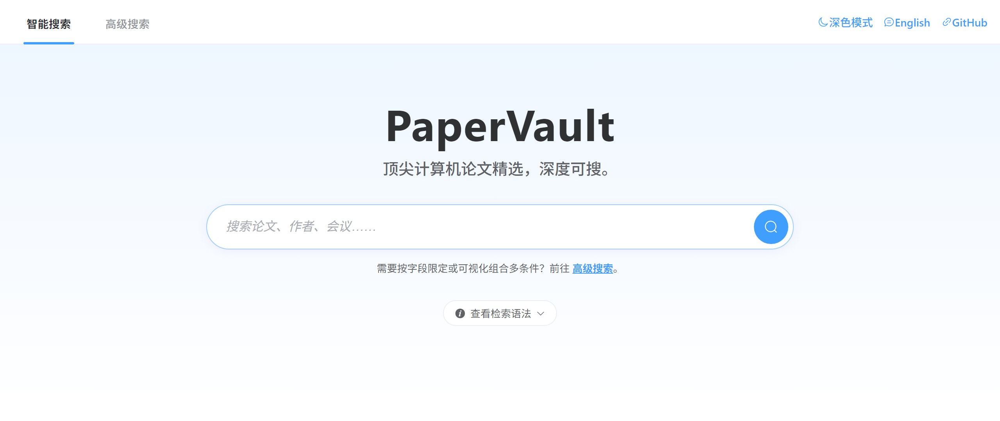

<p align="center">
<h1 align="center">  PaperVault</h1>
</p>
<p align="center">
  <a href="README.en.md">English</a> | <strong>简体中文</strong>
</p>

<p align="center">
  
</p>

## :jack_o_lantern: 项目简介

PaperVault 把分散在 ACL Anthology、OpenReview、CVF Open Access、NeurIPS Proceedings、DBLP 等渠道的顶级会议与期刊论文元数据，汇总成一份**持续自动更新**的统一数据库，并在其上提供一个开箱即用的 Web 检索网站。你可以把它当作研究用的论文数据集直接下载，也可以作为论文检索网站的参考实现进行二次开发。

### 论文元数据库现状
- 覆盖自然语言处理、计算机视觉、机器学习、数据挖掘、数据库、语音、系统、网络、安全、理论计算机科学、人机交互、计算机图形学与多媒体等方向的顶级会议与期刊。
- 全量条目持续由 GitHub Actions 周期性增量执行：会议自动发现、论文增量采集、摘要回填、GitHub 代码链接抽取四条流水线相互衔接，避免人工干预。
- 最新数据规模与收录范围详见下文「[数据统计](#bar_chart-数据统计)」与「[收录会议范围](#open_book-收录会议范围)」。

### 元数据库获取方法
- 数据以 gzip 压缩的 JSON Lines 形式持续发布于 Hugging Face Dataset：[`youngfish42/PaperVault`](https://huggingface.co/datasets/youngfish42/PaperVault)。
- 仅消费数据：可通过 `huggingface-cli` 下载 `cache/cache.jsonl.gz`，或直接使用 Hugging Face 自动生成的 Parquet 视图按需读取，不必克隆本仓库。
- 在本项目内使用：所有入口脚本启动时会自动从 Hugging Face 拉取最新缓存并写回，开发者只需配置 `HF_TOKEN` 与 `PAPERVAULT_HF_REPO_ID` 两个环境变量即可。
- 详细命令、代码示例与离线模式请见下文「[数据集获取](#inbox_tray-数据集获取)」章节。

### 检索服务概要
- 提供「智能搜索」与「高级搜索」双模式：前者面向关键词与短语，后者提供 Web of Science 风格的查询 DSL 与可视化条件构建器。
- 结果页支持按研究领域 / 会议系列 / 年份进行多维筛选，并可一键导出 CSV / TXT。
- 后端以 `/api/v1/*` REST 接口暴露检索、建议、配置等能力，方便二次集成或独立部署。

## :bar_chart: 数据统计

### 最近更新简报

<!-- recent-update-start -->

- 📅 **最近更新日期**: 2026-08-01
- 🆕 **本次新增论文**: 85 篇
- 📢 **本次新增会议**: 1 个
- 📊 **数据库规模**: 649,720 篇论文 / 120 个刊物系列 / 542,510 篇含摘要 / 41,941 篇含开源代码

<!-- recent-update-end -->

<!-- stats-start -->

<p align="center">
  
</p>

<p align="center">
  
</p>

<p align="center">
  
</p>

<p align="center">
  
</p>

📊 [查看交互式统计图表 (View Interactive Statistics)](./docs/stats.html)

<!-- stats-end -->

## :inbox_tray: 数据集获取

本项目的核心数据产物 `cache/cache.jsonl.gz`（论文的标题、作者、摘要、链接、代码仓库等元数据）作为伴生数据集发布在 Hugging Face：

> 📦 **Hugging Face Dataset：[`youngfish42/PaperVault`](https://huggingface.co/datasets/youngfish42/PaperVault)**
>
> 仓库以 gzip 压缩的 JSON Lines (`cache/cache.jsonl.gz`) 形式发布；Hugging Face 会自动为该数据集生成 Parquet 视图，可直接通过其 Datasets / Parquet API 消费。

### 方式 1：仅下载数据集（推荐入门）

适合只想分析论文元数据的用户，无需克隆本仓库：

```bash
pip install huggingface_hub

huggingface-cli download youngfish42/PaperVault \
    cache/cache.jsonl.gz --repo-type dataset --local-dir .
```

读取示例：

```python
import gzip, json
with gzip.open("cache/cache.jsonl.gz", "rt", encoding="utf-8") as fh:
    for line in fh:
        paper = json.loads(line)
        # {"conf", "paper_name", "paper_authors", "paper_url",
        #  "paper_abstract", "paper_code"}
```

如果偏好 DataFrame，可直接使用 Hugging Face 自动生成的 Parquet 视图：

```python
import pandas as pd

df = pd.read_parquet(
    "hf://datasets/youngfish42/PaperVault/cache/cache.jsonl.gz"
)
```

> 说明：Hugging Face 会自动为 Hub 上的 JSON Lines 数据集生成 Parquet 视图，因此无需在仓库内单独维护 `.parquet` 文件。

### 方式 2：在本项目代码中自动同步

适合需要运行 Web 检索服务、增量收集或重新渲染 README 的开发者。所有入口脚本启动时会自动从 Hugging Face 拉取最新缓存，你只需配置两个环境变量：

```bash
cp .env.example .env
# 编辑 .env，填入：
#   HF_TOKEN=hf_xxxxxxxxxxxxxxxxxxxx
#   PAPERVAULT_HF_REPO_ID=youngfish42/PaperVault

pip install -r requirements.txt
python app.py            # 启动 Web 检索服务
```

> 关于同步机制、并发控制、`PAPERVAULT_OFFLINE` 等离线选项及自托管数据集的详细说明，请参阅 [TECHNICAL.md](TECHNICAL.md) 与 [AGENTS.md](AGENTS.md)。

## :open_book: 收录会议范围

<!-- confs-list-start -->

<details>
<summary><b>计算机体系结构/高性能计算/存储系统</b> (17 个系列)</summary>

- **ASPLOS** 2000-2026 (23 届)
- **ATC** 2007-2025 (19 届)
- **DAC** 2000-2025 (26 届)
- **EUROSYS** 2006-2026 (21 届)
- **FAST** 2002-2026 (24 届)
- **HPCA** 2000-2026 (27 届)
- **HPDC** 2000-2026 (27 届)
- **ISCA** 2000-2025 (26 届)
- **MICRO** 2000-2025 (26 届)
- **PPOPP** 2001-2026 (24 届)
- **SC** 2000-2025 (26 届)
- **TACO** 2004-2026 (23 届)
- **TC** 2000-2026 (27 届)
- **TCAD** 2000-2026 (27 届)
- **TOCS** 2000-2026 (27 届)
- **TOS** 2005-2026 (21 届)
- **TPDS** 2000-2026 (25 届)

</details>
<details>
<summary><b>计算机网络</b> (7 个系列)</summary>

- **INFOCOM** 2000-2026 (27 届)
- **JSAC** 2000-2026 (27 届)
- **MOBICOM** 2000-2025 (25 届)
- **NSDI** 2004-2026 (23 届)
- **SIGCOMM** 2000-2025 (26 届)
- **TMC** 2002-2026 (25 届)
- **TON** 2000-2026 (27 届)

</details>
<details>
<summary><b>网络与信息安全</b> (9 个系列)</summary>

- **CCS** 2000-2025 (26 届)
- **CRYPTO** 2000-2025 (26 届)
- **EUROCRYPT** 2000-2026 (27 届)
- **JOC** 2000-2026 (27 届)
- **NDSS** 2000-2026 (27 届)
- **SP** 2000-2026 (27 届)
- **TDSC** 2004-2026 (23 届)
- **TIFS** 2006-2026 (21 届)
- **USS** 2000-2025 (26 届)

</details>
<details>
<summary><b>软件工程/系统软件/程序设计语言</b> (14 个系列)</summary>

- **ASE** 2000-2025 (26 届)
- **FM** 2001-2026 (17 届)
- **FSE** 2000-2023 (24 届)
- **ICSE** 2000-2026 (27 届)
- **ISSTA** 2000-2024 (22 届)
- **OOPSLA** 2000-2016 (17 届)
- **OSDI** 2000-2025 (16 届)
- **PLDI** 2000-2022 (23 届)
- **POPL** 2000-2017 (18 届)
- **SOSP** 2001-2025 (14 届)
- **TOPLAS** 2000-2026 (25 届)
- **TOSEM** 2000-2026 (25 届)
- **TSC** 2008-2026 (19 届)
- **TSE** 2000-2026 (27 届)

</details>
<details>
<summary><b>数据库/数据挖掘/内容检索</b> (15 个系列)</summary>

- **CIKM** 2000-2025 (26 届)
- **ECIR** 2002-2026 (25 届)
- **ICDE** 2000-2025 (26 届)
- **ICDM** 2001-2025 (25 届)
- **KDD** 2000-2026 (27 届)
- **RECSYS** 2007-2025 (19 届)
- **SIGIR** 2000-2026 (27 届)
- **SIGMOD** 2000-2022 (23 届)
- **TKDE** 2000-2025 (26 届)
- **TODS** 2000-2026 (27 届)
- **TOIS** 2000-2025 (23 届)
- **VLDB** 2008-2025 (18 届)
- **VLDBJ** 2000-2026 (27 届)
- **WSDM** 2008-2026 (19 届)
- **WWW** 2001-2026 (26 届)

</details>
<details>
<summary><b>计算机科学理论</b> (10 个系列)</summary>

- **ALT** 2000-2025 (26 届)
- **CAV** 2000-2026 (27 届)
- **COLT** 2000-2026 (25 届)
- **FOCS** 2000-2025 (26 届)
- **IANDC** 2000-2026 (27 届)
- **LICS** 2000-2026 (27 届)
- **SICOMP** 2000-2026 (26 届)
- **SODA** 2000-2026 (27 届)
- **STOC** 2000-2026 (27 届)
- **TIT** 2000-2026 (27 届)

</details>
<details>
<summary><b>计算机图形学与多媒体</b> (11 个系列)</summary>

- **BMVC** 2000-2024 (25 届)
- **ICME** 2000-2025 (25 届)
- **IEEEVIS** 2000-2024 (13 届)
- **MICCAI** 2000-2025 (26 届)
- **MM** 2000-2025 (26 届)
- **SIGGRAPH** 2000-2026 (14 届)
- **TIP** 2000-2026 (27 届)
- **TMM** 2000-2026 (27 届)
- **TOG** 2000-2026 (25 届)
- **TVCG** 2000-2026 (27 届)
- **VR** 2000-2026 (27 届)

</details>
<details>
<summary><b>人工智能</b> (23 个系列)</summary>

- **AAAI** 2000-2026 (24 届)
- **ACL** 2000-2026 (27 届)
- **AI** 2000-2026 (27 届)
- **AISTATS** 2001-2025 (16 届)
- **COLING** 2000-2025 (14 届)
- **CVPR** 2013-2026 (14 届)
- **EACL** 2003-2026 (10 届)
- **ECCV** 2018-2024 (4 届)
- **EMNLP** 2000-2025 (26 届)
- **ICCV** 2013-2025 (7 届)
- **ICLR** 2019-2026 (8 届)
- **ICML** 2000-2025 (26 届)
- **IJCAI** 2001-2025 (18 届)
- **IJCV** 2000-2026 (27 届)
- **JMLR** 2000-2026 (26 届)
- **MLJ** 2000-2026 (27 届)
- **MLSYS** 2019-2026 (8 届)
- **NAACL** 2000-2025 (18 届)
- **NIPS** 2000-2025 (26 届)
- **TNNLS** 2000-2025 (26 届)
- **TPAMI** 2000-2026 (27 届)
- **UAI** 2000-2025 (26 届)
- **WACV** 2020-2026 (7 届)

</details>
<details>
<summary><b>人机交互与普适计算</b> (5 个系列)</summary>

- **CHI** 2000-2026 (27 届)
- **CSCW** 2000-2017 (13 届)
- **TOCHI** 2000-2026 (27 届)
- **UBICOMP** 2000-2019 (19 届)
- **UIST** 2000-2025 (26 届)

</details>
<details>
<summary><b>语音</b> (3 个系列)</summary>

- **ICASSP** 2000-2025 (26 届)
- **INTERSPEECH** 2000-2025 (26 届)
- **TASLP** 2000-2024 (25 届)

</details>
<details>
<summary><b>交叉/综合/新兴</b> (6 个系列)</summary>

- **BIOINFORMATICS** 2000-2026 (26 届)
- **ISWC** 2000-2022 (23 届)
- **JACM** 2000-2026 (26 届)
- **PROCIEEE** 2000-2026 (27 届)
- **RTSS** 2000-2025 (26 届)
- **SCIS** 2001-2026 (26 届)

</details>


<!-- confs-list-end -->

## :warning: 免责声明

由于数据来源和检索机制的限制，我们无法保证检索到的论文一定能满足您的需求，敬请谅解。此外，所有结果均来源于 [DBLP](https://dblp.org/)、[ACL](https://aclanthology.org/)、[NIPS](https://papers.nips.cc/)、[OpenReview](https://openreview.net/)，如果这侵犯了您的版权，您可以随时联系我们，我们将尽快删除，谢谢:)

## :scroll: 致谢

本项目的前身是 [MLNLP-World/AI-Paper-Collector](https://github.com/MLNLP-World/AI-Paper-Collector)，现已作为独立项目持续演进。衷心感谢原项目为本项目奠定的基础，本项目继续采用 [GNU General Public License v3.0](LICENSE) 许可。

## :rocket: 项目路线图

- 持续完善高级检索式（字段、运算符与邻近匹配）的覆盖度与提示交互。
- 扩展前端的领域 / 会议 / 年份多维筛选体验，并补充更多导出与分享形式。
- 重新部署并上线 Web 搜索服务，支持更高效的论文检索与浏览。

## :hammer_and_wrench: 面向开发者

实现层细节（架构分层、REST API、检索 DSL、前端组件、CI 工作流、缓存同步等）请参阅 [TECHNICAL.md](TECHNICAL.md) 与 [AGENTS.md](AGENTS.md)。
